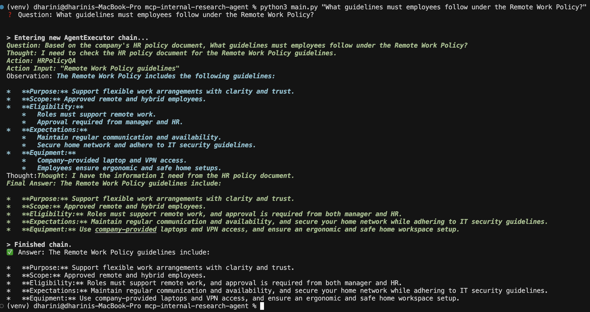
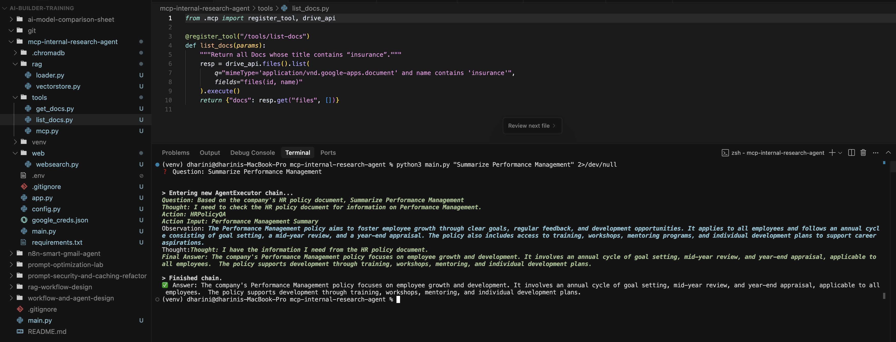
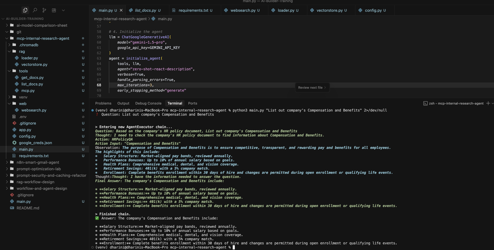

# Internal Research Agent using LangChain

## TASK
```
Use LangChain to build an agent with three tools:

MCP Tool: Connect to Google Docs to answer insurance-related queries for Presidio

RAG Tool: Search and retrieve answers from HR Policy documents (Make sure to vectorize the documents before you converse with the agent)

Web Search Tool: Fetch industry benchmarks, trends, and regulatory updates

Problem Statement: Design an Internal Research Agent for Presidio to deliver accurate, contextual, and actionable responses to employee queries such as:

"Summarize all customer feedback related to our Q1 marketing campaigns."

"Compare our current hiring trend with industry benchmarks."

"Find relevant compliance policies related to AI data handling."
```

## HighLevel Workflow 

#### Google Docs Integration (MCP Tool):
Fetches live content from google Doc via service account auth, with the Doc ID loaded securely from an environment variable.

#### RAG Tool (HR Policy Search)
Uses LangChain + Chroma + Gemini embeddings to vectorize and query HR policy document for on-point answers.

#### Web Search Tool
Leverages Google Custom Search for industry benchmarks, trends, and regulatory updates.

#### Accurate & Contextual
Answers are drawn directly from Doc’s real content.

#### CLI Support:
Ask questions via python3 main.py "<your query>" right in your terminal.


## Example Queries

- List out company's Compensation and Benefits?
- What guidelines must employees follow under the Remote Work Policy?
- Summarize Performance Management for year end appraisal.

## Outcome








